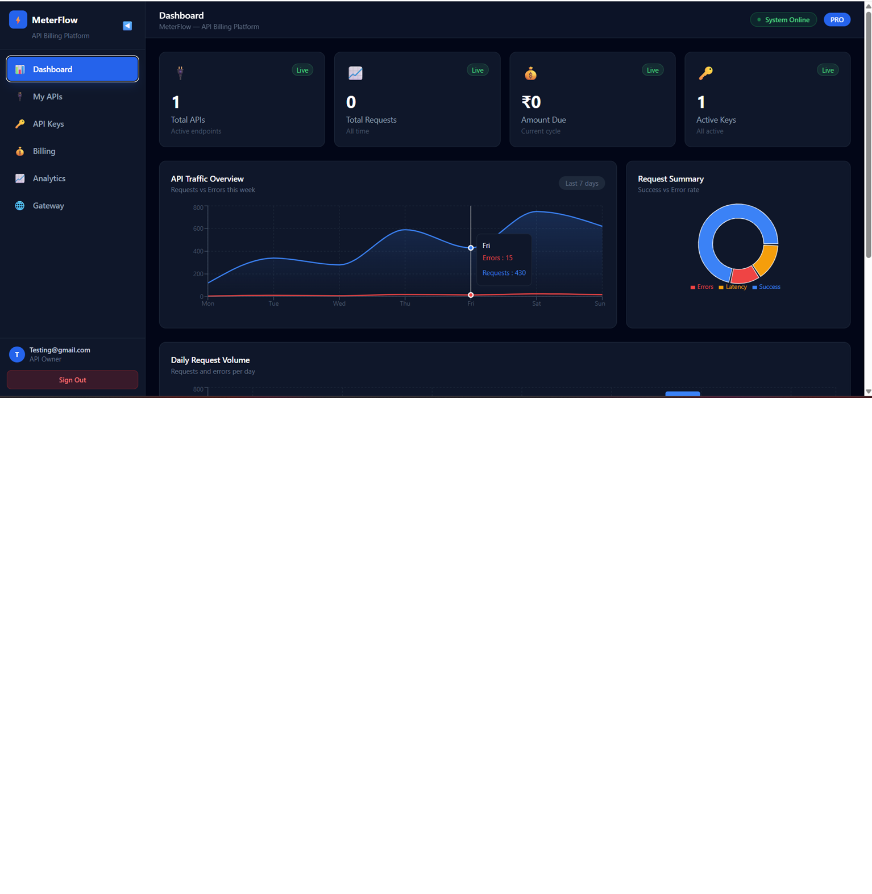
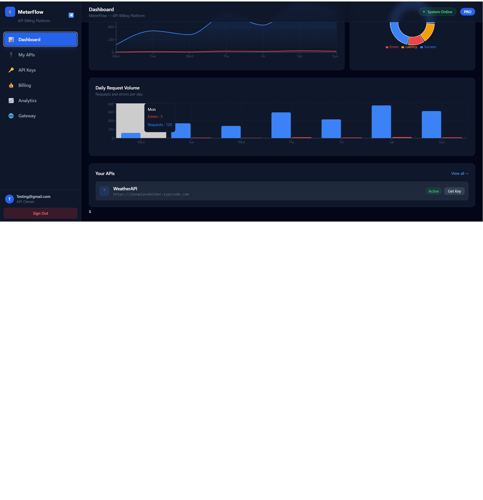
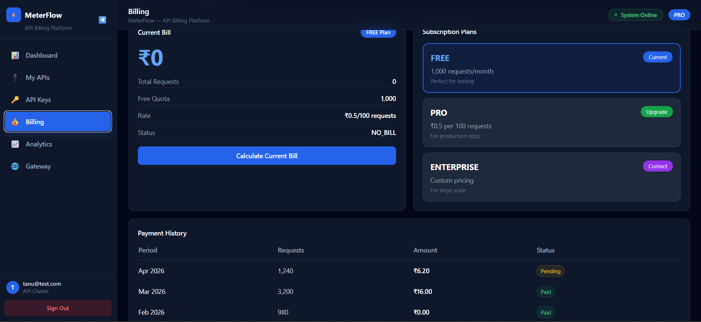
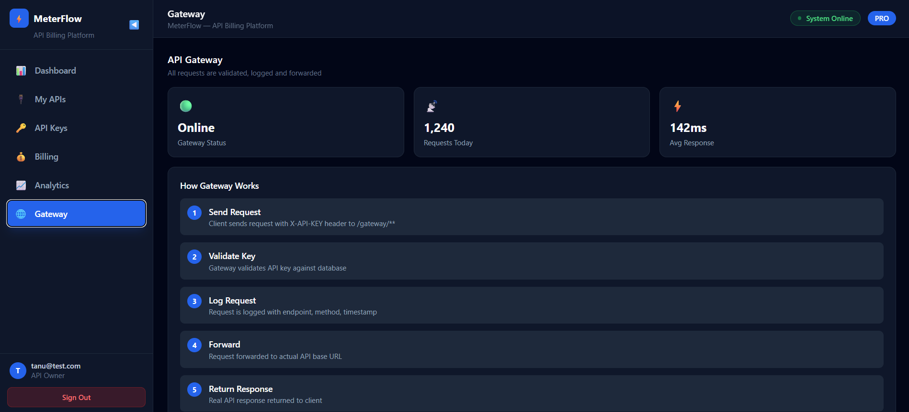
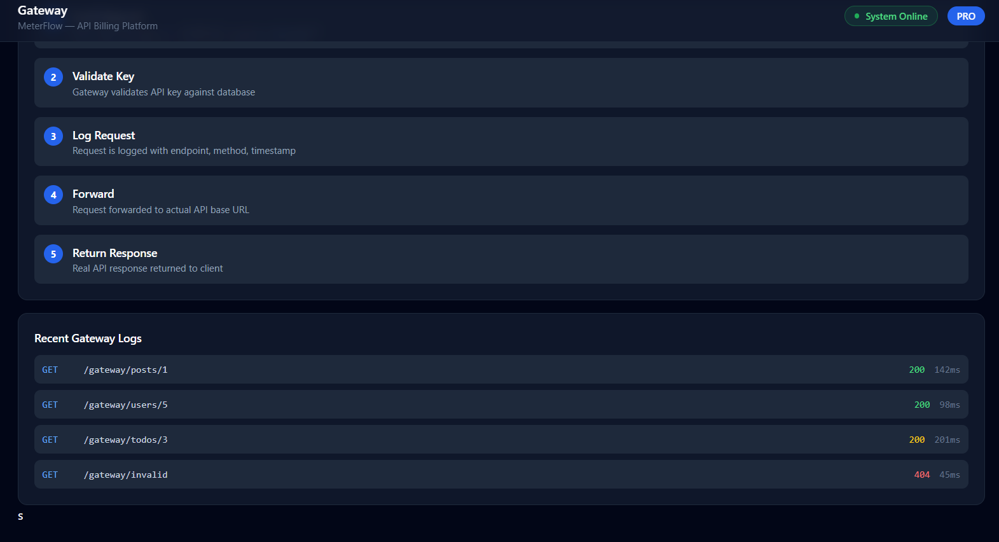

# MeterFlow — Usage-Based API Billing Platform

A full-stack SaaS platform inspired by Stripe and AWS API Gateway.

## Live Demo
- Frontend: https://meterflow-frontend-git-main-sakshitmaths-projects.vercel.app
- Backend: https://meterflow-backend-kbyx.onrender.com

## Features
- JWT Authentication (Register/Login)
- Create and manage APIs
- Generate API Keys
- API Gateway with X-API-KEY header
- Usage logging for every request
- Billing engine (current/history/calculate)
- Analytics dashboard with charts

## Tech Stack
- Backend: Spring Boot 3.3.6, Java 21, PostgreSQL
- Frontend: React, Tailwind CSS, Recharts, Vite
- Security: JWT + Spring Security
- Deployment: Render (backend) + Vercel (frontend)

## Setup Locally
### Backend
cd backend
mvn clean install
./mvnw spring-boot:run

### Frontend
cd frontend
npm install
npm run dev

## Screenshots

### Login Page

### Dashboard

### Dashboard 2

### My APIs

### API Keys

### Billing

### Gateway

### Gateway Logs

